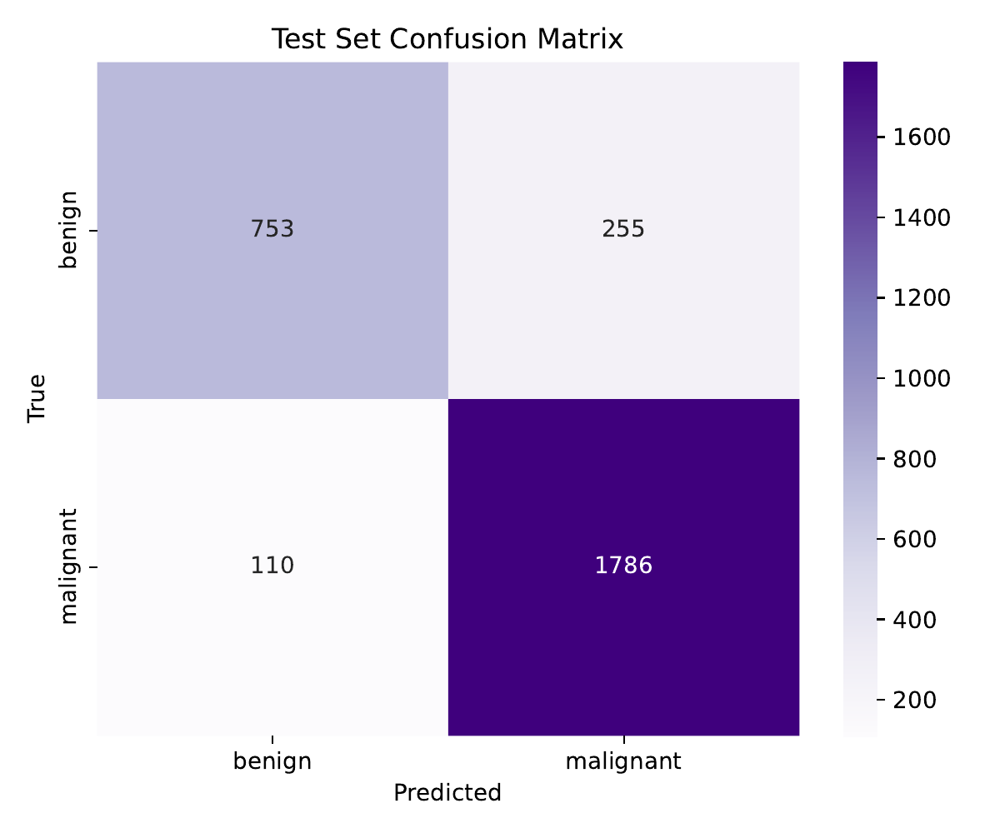
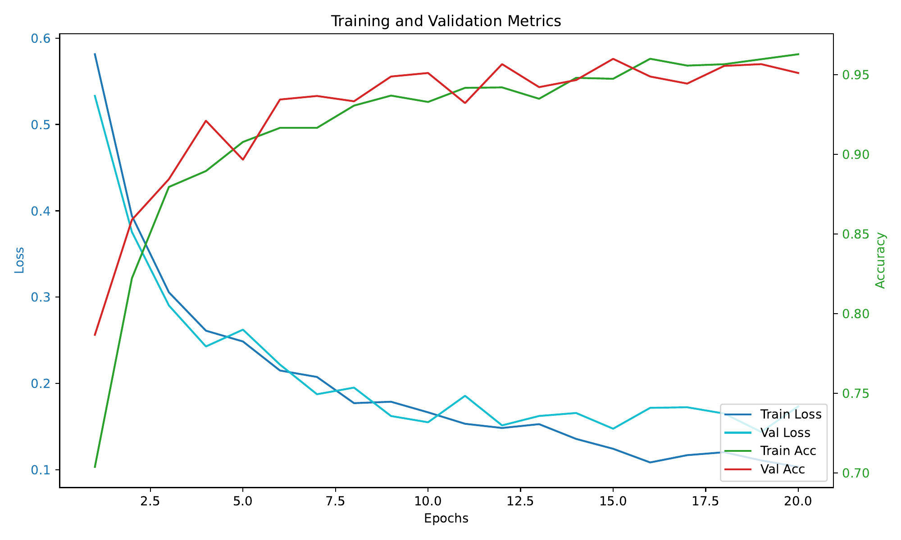

# 🧠 Breast Cancer Image Classifier with ResNet50

This project uses transfer learning with ResNet50 to classify breast cancer subtypes from histopathology images.

## 💡 Overview
- **Goal**: Multi-class classification of breast cancer subtypes
- **Data**: BreakHis dataset (benign vs malignant + subtypes)
- **Model**: ResNet50 pretrained on ImageNet
- **Tools**: PyTorch, torchvision, matplotlib, numpy

## 🔬 Method
1. Preprocessed `.npy` histopathology images
2. Fine-tuned `ResNet50` with new classification head
3. Used learning rate scheduler, early stopping, data augmentation and class weights
4. Evaluated with F1-score, confusion matrix, and ROC-AUC

## 📥 Download Pretrained Model

You can download the fine-tuned ResNet50 model (`best_model.pt`) from the link below:

🔗 https://drive.google.com/file/d/1qgGBZacJ3TrvERhNy2B0x5Upk__DWJRU/view?usp=drive_link

After downloading, place the file in the `models/` folder:


## 🧪 Final Test Set Performance

This model was evaluated on a held-out test set after hyperparameter tuning and early stopping.  
Performance metrics were computed from the final confusion matrix and ROC-AUC curve.

| Metric     | Value     |
|------------|-----------|
| Accuracy   | **95.18%** |
| Precision  | **98.14%** |
| Recall     | **95.26%** |
| F1 Score   | **96.68%** |
| AUC        | **95.11%** |


📊 Confusion Matrix:

  

📈 Training and Validation curve:



> 🎯 This model achieved high precision and recall, indicating strong ability to distinguish benign from malignant samples — a critical need in medical diagnosis.

## 🧠 Key Learnings
- Transfer learning is highly effective on medical images
- Balanced validation and early stopping helped generalize better
- Visualizing confusion matrix revealed subtype misclassification patterns

## 🚀 How to Run
```bash
# 1. Install dependencies
pip install -r requirements.txt

# 2. Run training
python src/train.py

# 3. Evaluate or load model
python src/utils.py --model models/best_model.pt
